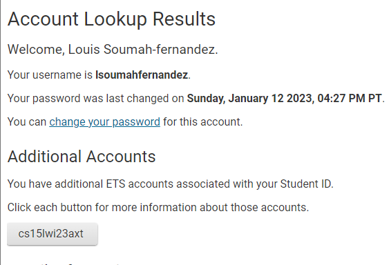
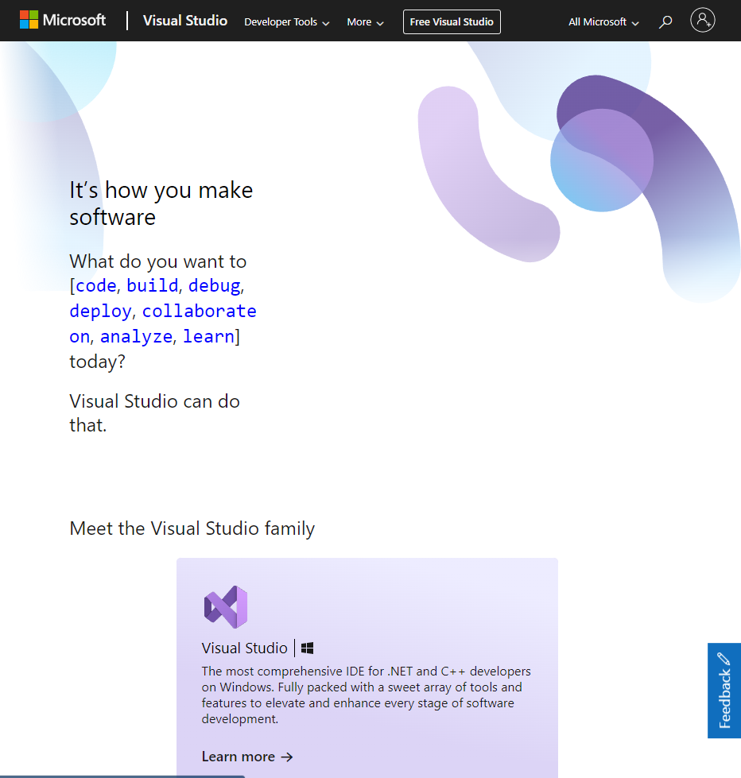
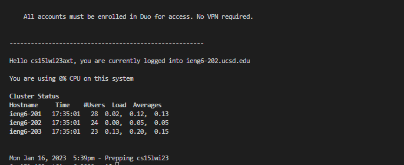

<h1>CSE 15 Lab</h1>

<h2>Step 0 - Create Your CSE15L Account </h2>

Remember to annotate your <b>Specific Code</b>
Go to this link and reset the password and follow the steps.
Put your username and student ID
 Then it will appear as:
 
 
 
<h2>Step 1 - Download Visual Studio </h2>
To Download Visual Studio go to the website <a href="https://code.visualstudio.com/">https://code.visualstudio.com/</a>
Follow the steps and download it and install it for your specific operating system

The website looks like: 

<h2>Step 2 - Connect to Remote System</h2>

<h3>Windows</h3>
In Windows you should Install GIT

The link is https://gitforwindows.org/ 

<h3>Mac</h3>
In Mac or Linux that is not necessary

<h2>Step 3 - Connect to the remote server</h2>
In order to connect to the remote server you should put the following command: 

```
$ ssh cs15lwi23___@ieng6.ucsd.edu
```
Instead of putting ___ you should put your specific code

Put some commands such as:





To check it works

Then put your password of the CSE15L and you are set
